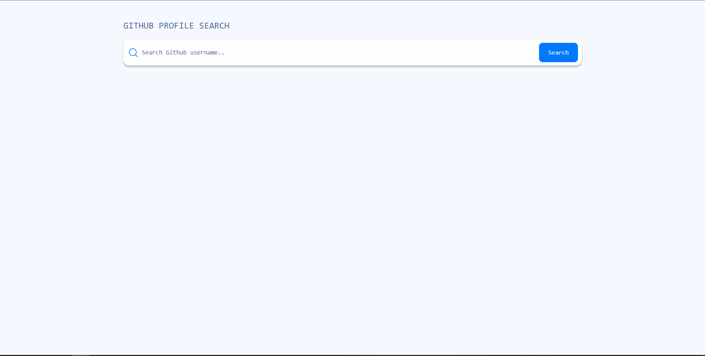
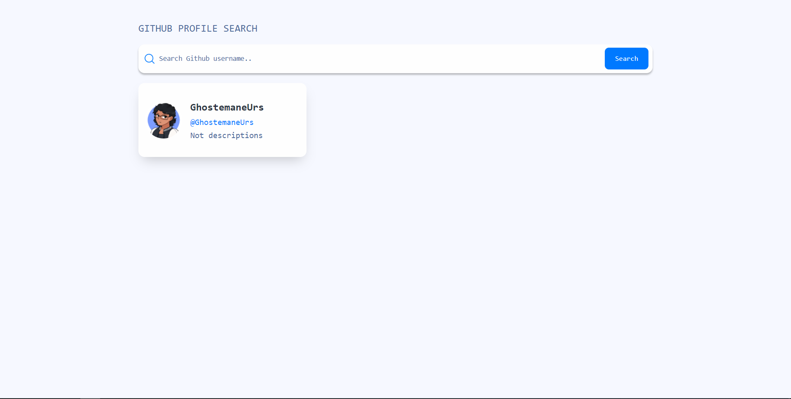
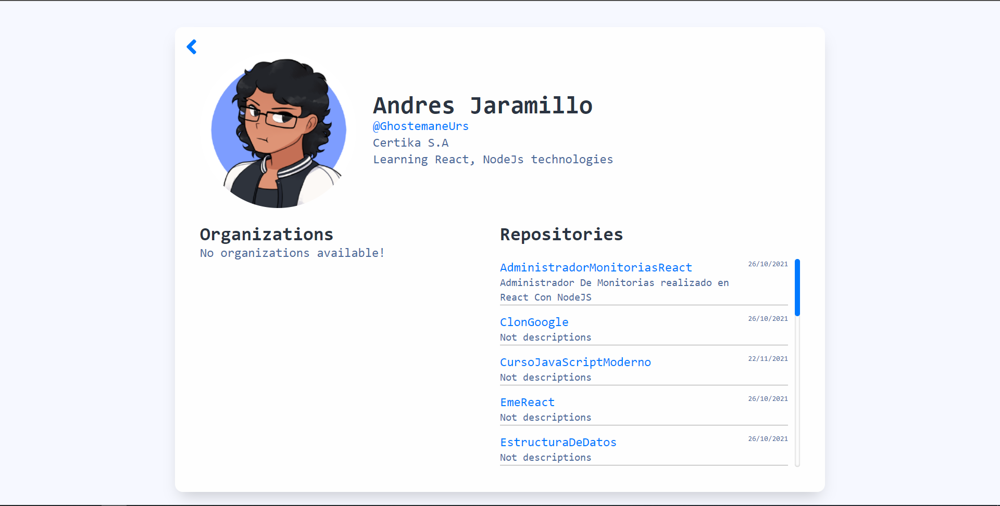

# GitHub Profile Search

Se han usado las siguientes tecnologías para la realización de este proyecto; ReactJS, Redux, Redux Thunk, Redux Toolkit, Tailwindcss. Todas estas cumplieron un papel demasiado fuerte en el desarrollo de esta aplicación.

## Caracteristicas
- ReactJS: Fue utilizado para construir la página web de manera interactiva y responsive.
- Tailwindcss: Me permitió realizar la maquetación de estilos en mi proyecto, aportándome una gran variedad de clases que pude usar.
- Redux: Me permitió manejar el estado de la aplicación de una manera predecible.
- Redux Thunk: Es un middleware que me permite utilizar asincronismo en mi manejador de datos.
- Redux Toolkit: Me permite configurar la store de mi redux de una manera más sencilla.

## Documentación de las tecnologías usadas
-  [Redux](https://redux.js.org/introduction/getting-started)
-  [ReactJs](https://es.reactjs.org/)
-  [Tailwindcss](https://tailwindcss.com/docs)
-  [Redux Thunk](https://redux.js.org/usage/writing-logic-thunks)
-  [Redux Toolkit](https://redux-toolkit.js.org/introduction/getting-started)

## Instalación del proyecto
- Se requiere tener instalado [Node.js](https://nodejs.org/) v10+.
- Clonar el repositorio con el comando git clone + la ruta del proyecto
- Guía para la instalación de las dependencias para correr el proyecto.

```sh
cd GitHubProfile
yarn
yarn start
```
## Previsualización del proyecto



